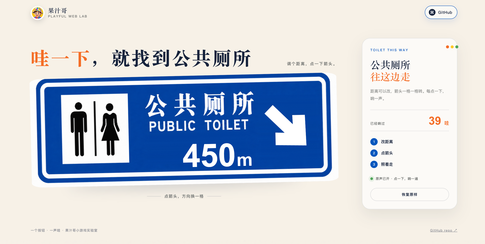

# 哇噻小游戏

项目名 `wah-sign-game`，中文叫「哇噻小游戏」。

一个打开就能玩的网页小游戏。

牌子上显示距离，右边是方向。点一下箭头，方向转一格，同时响一声“哇”。

## 在线试玩

[打开哇噻小游戏](https://wa.tan-xin.com/)



## 玩法

- 点击距离数字，输入新的米数，最多 4 位数字。
- 点击右侧箭头，每次转动 45°，八个方向都会走到。
- 鼠标、触摸和键盘都能操作；按空格也可以让箭头转一次。
- 每次点击播放一次约 2 秒的原声音效，不自动播放、不循环；连续点击时，各次声音可以自然叠在一起。

## 设计与实现

- 牌面使用真实的公共厕所指示牌图片。
- 初始距离为 `450m`，数字和箭头在切换前后保持同一尺寸。
- 桌面端与手机端自适应，横屏和竖屏都能正常显示。
- 支持键盘焦点和 `prefers-reduced-motion`，不依赖第三方脚本或在线字体。
- 不需要数据库、服务器或构建工具，直接打开 `index.html` 即可。
- 音效使用录音片段；每次点击复制一个独立的音频播放实例，因此连续点击时不会截断上一声。

## 本地运行

直接双击 `index.html` 即可打开。

如果浏览器对本地文件的音频策略较严格，可以在项目目录启动静态服务：

```bash
python3 -m http.server 8124
```

然后访问 <http://localhost:8124>。

## 项目结构

```text
.
├── index.html
├── package.json
├── server.mjs
├── railway.json
├── assets/
│   ├── juicebro-avatar.jpg
│   ├── public-toilet-sign.png
│   ├── public-toilet-sign-clean.png
│   ├── wah-sound.wav
│   └── website-screenshot.png
├── LICENSE
└── README.md
```

## 素材说明

`public-toilet-sign.png` 是页面使用的原始牌面图片；`public-toilet-sign-clean.png` 是为了让距离和箭头可以动态替换而准备的清理层；`wah-sound.wav` 是用户提供的录音中截取的约 2 秒音效片段；果汁哥头像是页面品牌素材。

`website-screenshot.png` 是网页截图，用于项目展示和引流。

代码和页面结构采用 MIT License，见 [LICENSE](LICENSE)。图片与品牌素材的使用范围以素材权利人的授权为准，MIT 不会自动扩大这些素材的授权范围。

## GitHub

本项目由果汁哥维护：<https://github.com/Juicebro-star/wah-sign-game>
